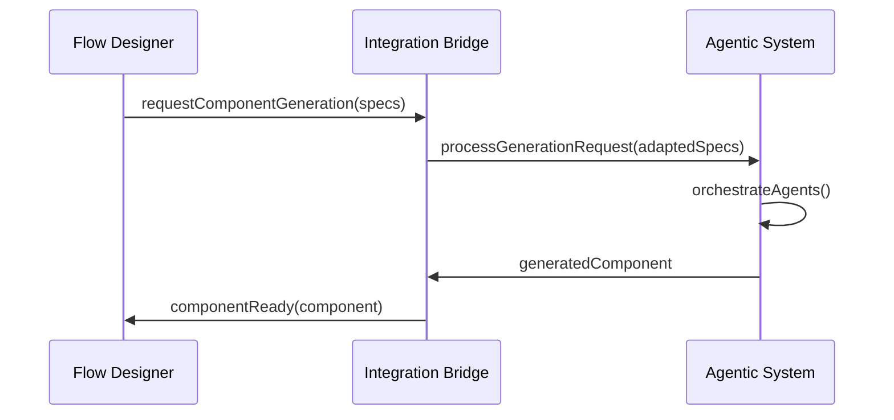

# 🏗️ Arquitectura de Separación por Equipos

## 🎯 **Objetivo**
Implementar una arquitectura que permita que múltiples equipos trabajen de forma independiente sin generar conflictos, utilizando la **Opción A Híbrida** para separar el Flow Designer original del nuevo Sistema Agéntico.

---

## 📋 **Estructura de Directorios Propuesta**

```
flow-designer/
├── src/
│   ├── flow-designer/           # 🎨 EQUIPO FLOW DESIGNER
│   │   ├── components/         # Nodos, edges, canvas existentes
│   │   │   ├── FlowCanvas.vue
│   │   │   ├── CustomNode.vue
│   │   │   ├── CustomEdge.vue
│   │   │   └── [componentes existentes]
│   │   ├── composables/        # Lógica del designer
│   │   │   ├── useFlowStore.ts
│   │   │   ├── useNodeManager.ts
│   │   │   └── [composables existentes]
│   │   ├── stores/            # Estado del flow (Pinia)
│   │   │   ├── flowStore.ts
│   │   │   └── nodeStore.ts
│   │   ├── utils/             # Utilidades del designer
│   │   │   ├── flowUtils.ts
│   │   │   └── validationUtils.ts
│   │   ├── types/             # Tipos específicos del designer
│   │   │   ├── FlowTypes.ts
│   │   │   └── NodeTypes.ts
│   │   └── views/             # Vistas del designer
│       │   └── FlowDesigner.vue
│   │
│   ├── agentic-system/         # 🤖 EQUIPO SISTEMA AGÉNTICO
│   │   ├── agents/            # ComponentAgents especializados
│   │   │   ├── base/
│   │   │   │   ├── ComponentAgent.ts
│   │   │   │   └── AgentCapabilities.ts
│   │   │   ├── specialists/
│   │   │   │   ├── BankingAgent.ts
│   │   │   │   ├── ValidationAgent.ts
│   │   │   │   ├── UIAgent.ts
│   │   │   │   ├── FormAgent.ts
│   │   │   │   ├── IntegrationAgent.ts
│   │   │   │   └── ReviewerAgent.ts
│   │   │   └── index.ts
│   │   ├── orchestrator/      # Crew orchestration
│   │   │   ├── ComponentCrew.ts
│   │   │   ├── TaskManager.ts
│   │   │   └── WorkflowEngine.ts
│   │   ├── llm-integration/   # Configuración y wrapper LLM
│   │   │   ├── OllamaClient.ts
│   │   │   ├── ModelSelector.ts
│   │   │   ├── PromptTemplates.ts
│   │   │   └── ResponseParser.ts
│   │   ├── tools/             # Herramientas especializadas
│   │   │   ├── BankingTools.ts
│   │   │   ├── ValidationTools.ts
│   │   │   └── ComponentTemplates.ts
│   │   ├── types/             # Interfaces agénticas
│   │   │   ├── AgentTypes.ts
│   │   │   ├── ComponentSpec.ts
│   │   │   └── BankingTypes.ts
│   │   └── config/           # Configuración del sistema
│       │   ├── ModelConfig.ts
│       │   └── AgentConfig.ts
│   │
│   ├── integration/           # 🔗 EQUIPO INTEGRACIÓN (Puente)
│   │   ├── bridge/           # Conectores entre sistemas
│   │   │   ├── DesignerAgenticBridge.ts
│   │   │   ├── ComponentRegistry.ts
│   │   │   └── EventBridge.ts
│   │   ├── adapters/         # Adaptadores de datos
│   │   │   ├── FlowToAgentAdapter.ts
│   │   │   └── AgentToComponentAdapter.ts
│   │   ├── types/            # Tipos compartidos
│   │   │   ├── BridgeTypes.ts
│   │   │   └── SharedInterfaces.ts
│   │   └── services/         # Servicios de comunicación
│       │   ├── MessageBus.ts
│       │   └── StateSync.ts
│   │
│   ├── components/           # 🧩 Componentes UI comunes (SIN CAMBIOS)
│   ├── composables/          # Composables originales (SIN CAMBIOS)  
│   ├── services/             # Servicios originales (SIN CAMBIOS)
│   ├── stores/               # Stores originales (SIN CAMBIOS)
│   ├── utils/                # Utils originales (SIN CAMBIOS)
│   └── views/                # Views originales (SIN CAMBIOS)
│
├── docs/
│   ├── AIFrontends/          # Documentación agéntica existente
│   ├── flow-designer/        # 📖 Documentación equipo Flow Designer
│   │   ├── API.md
│   │   ├── COMPONENTES.md
│   │   └── ROADMAP.md
│   ├── agentic-system/       # 📖 Documentación equipo Agéntico
│   │   ├── AGENTS.md
│   │   ├── ARQUITECTURA.md
│   │   └── CONFIGURACION.md
│   └── integration/          # 📖 Documentación equipo Integración
│       ├── BRIDGE.md
│       └── PROTOCOLS.md
│
└── [resto del proyecto sin cambios]
```

---

## 👥 **Separación por Equipos de Trabajo**

### **🎨 EQUIPO FLOW DESIGNER**
**Responsabilidades:**
- Mantenimiento y evolución del Flow Designer existente
- Nuevos tipos de nodos y conexiones
- Mejoras en UI/UX del canvas
- Optimización de rendimiento del designer

**Directorio de trabajo:** `src/flow-designer/`
**Archivos que NO deben tocar:**
- `src/agentic-system/` 
- `src/integration/` (solo lectura para entender interfaces)

**Archivos que SÍ pueden modificar:**
- Todo dentro de `src/flow-designer/`
- `src/components/` (componentes UI compartidos)
- `src/views/` (vistas existentes)

### **🤖 EQUIPO SISTEMA AGÉNTICO** 
**Responsabilidades:**
- Desarrollo de ComponentAgents especializados
- Integración con modelos LLM (Ollama)
- Sistema de orchestración (CrewAI-like)
- Herramientas especializadas bancarias

**Directorio de trabajo:** `src/agentic-system/`
**Archivos que NO deben tocar:**
- `src/flow-designer/`
- `src/integration/` (solo lectura para entender interfaces)

**Archivos que SÍ pueden modificar:**
- Todo dentro de `src/agentic-system/`
- `docs/agentic-system/`

### **🔗 EQUIPO INTEGRACIÓN**
**Responsabilidades:**
- Puente de comunicación entre Flow Designer y Sistema Agéntico  
- Adaptadores de datos
- Message Bus y sincronización de estado
- APIs de integración

**Directorio de trabajo:** `src/integration/`
**Archivos que NO deben tocar:**
- `src/flow-designer/` (solo lectura)
- `src/agentic-system/` (solo lectura)

**Archivos que SÍ pueden modificar:**
- Todo dentro de `src/integration/`
- Interfaces públicas de ambos sistemas
- `docs/integration/`

---

## 🔄 **Protocolo de Comunicación entre Equipos**

### **Flujo de Trabajo Típico:**



### **Interfaces de Comunicación:**

```typescript
// src/integration/types/BridgeTypes.ts
interface ComponentGenerationRequest {
  nodeId: string
  componentType: 'form' | 'validation' | 'integration'
  bankingContext: BankingContext
  requirements: ComponentRequirements
}

interface ComponentGenerationResponse {
  success: boolean
  component?: Vue.Component
  metadata?: ComponentMetadata
  errors?: string[]
}
```

---

## 📋 **Reglas de Convivencia**

### **✅ PERMITIDO**
- Cada equipo trabaja en su directorio asignado
- Lectura de interfaces públicas de otros equipos
- Modificación de documentación de su equipo
- Uso de tipos compartidos en `src/integration/types/`

### **❌ PROHIBIDO**
- Modificar código de otros equipos directamente
- Cambiar interfaces sin consenso
- Commits que afecten múltiples equipos sin coordinación
- Dependencias circulares entre directorios

### **⚠️ REQUIERE COORDINACIÓN**
- Cambios en interfaces públicas
- Nuevos tipos compartidos
- Modificaciones en `src/integration/`
- Cambios en estructura de archivos

---

## 🚀 **Ventajas de Esta Arquitectura**

### **Para el Desarrollo:**
- ✅ **Separación Clara**: Cada equipo tiene su dominio bien definido
- ✅ **Sin Conflictos**: No hay overlapping en archivos de trabajo
- ✅ **Escalabilidad**: Fácil agregar nuevos equipos o módulos
- ✅ **Testeo Independiente**: Cada sistema puede probarse por separado

### **Para el Producto:**
- ✅ **Mantenibilidad**: Código organizado por dominio
- ✅ **Flexibilidad**: Sistemas pueden evolucionar independientemente
- ✅ **Reutilización**: Componentes compartidos claramente identificados
- ✅ **Deploy Independiente**: Posibilidad de releases separados

---

## 📝 **Próximos Pasos**

1. **Migración Gradual**: Mover componentes existentes a `src/flow-designer/`
2. **Setup Inicial**: Crear estructura de `src/agentic-system/`
3. **Bridge Básico**: Implementar `src/integration/` mínimo
4. **Documentación**: Completar docs por equipo
5. **Validación**: Testing de la separación

---

**Fecha de Creación**: 23 de Agosto, 2025  
**Estado**: Propuesta aprobada - Lista para implementación
**Responsable**: GitHub Copilot + erdnando
