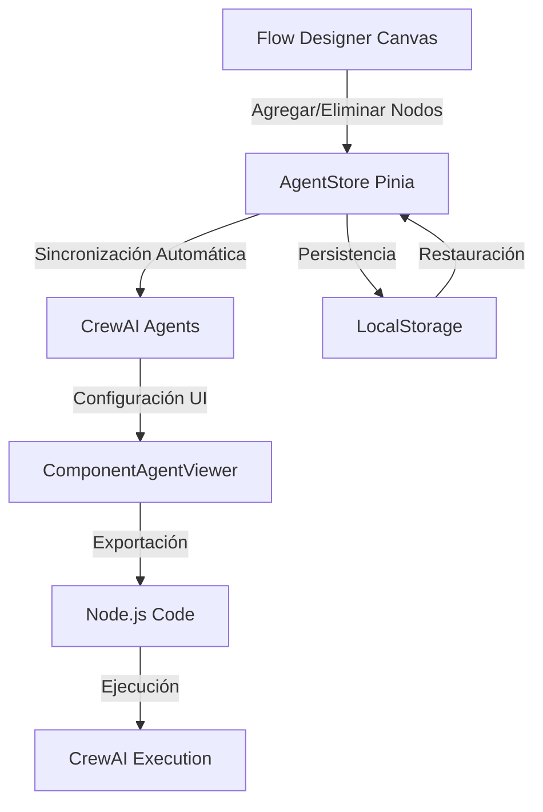

# 🤖 Sistema Agéntico Dinámico - Node.js CrewAI

## 📋 Resumen Ejecutivo

**Estado**: ✅ **COMPLETAMENTE IMPLEMENTADO** (Agosto 2025)

Este sistema implementa una versión completa de CrewAI para Node.js/TypeScript que se integra dinámicamente con el Flow Designer. Cada nodo del diseñador de flujos genera automáticamente un agente configurable, eliminando la necesidad de registries estáticos.

## � Decisiones Estratégicas Clave

### ❌ **Rechazado**: Python CrewAI Original
- **Razón**: Inconsistente con el ecosistema JavaScript/Node.js del proyecto
- **Decisión**: Implementar versión nativa para Node.js

### ✅ **Adoptado**: Implementación Node.js Nativa
- **Ventaja**: Total integración con Vue 3 + TypeScript + Vite
- **Beneficio**: Sin dependencias externas de Python
- **Resultado**: Sistema 100% JavaScript/TypeScript

## 🏗️ Arquitectura Técnica



## 📂 Estructura de Archivos Implementada

```
src/
├── stores/
│   └── agentStore.ts                    # ✅ Store principal de agentes (Pinia)
├── integration/bridge/
│   └── ComponentAgentViewer.vue         # ✅ Interfaz completa de configuración
├── lib/crew-nodejs/
│   └── index.ts                         # ✅ Librería CrewAI nativa Node.js
├── examples/
│   └── crew-usage-example.ts            # ✅ Ejemplos de uso completos
├── components/
│   └── FlowCanvas.vue                   # ✅ Integración con agentStore
└── docs/
    └── SISTEMA-AGENTICO-NODEJS.md       # ✅ Esta documentación
```

## 🔧 Componentes Implementados

### 1. **AgentStore** (`src/stores/agentStore.ts`)
**Estado**: ✅ **COMPLETAMENTE FUNCIONAL**

**Funcionalidades**:
- ✅ Sincronización automática: nodos ↔ agentes
- ✅ Persistencia en localStorage
- ✅ Generación de código JavaScript (CommonJS)
- ✅ Generación de código TypeScript (ES Modules)
- ✅ Generación automática de package.json
- ✅ Exportación JSON completa
- ✅ Sistema reactivo con Pinia

**Tipos Principales**:
```typescript
export interface CrewAIAgent {
  id: string
  nodeId: string        // Referencia al nodo del designer
  role: string          // Rol del agente
  goal: string          // Objetivo principal
  backstory: string     // Historia/contexto
  tasks: AgentTask[]    // Tareas asignadas
  tools: AgentTool[]    // Herramientas disponibles
  actions: AgentAction[] // Acciones UI (clicks, etc.)
  inputs: AgentParameter[]  // Parámetros de entrada
  outputs: AgentParameter[] // Parámetros de salida
  htmlView?: string     // Vista HTML personalizada
  position?: number     // Orden de ejecución
}
```

### 2. **ComponentAgentViewer** (`src/integration/bridge/ComponentAgentViewer.vue`)
**Estado**: ✅ **INTERFAZ COMPLETA IMPLEMENTADA**

**Características**:
- ✅ Grid responsive para múltiples agentes
- ✅ Sistema de tabs por agente:
  - **⚙️ Configuración**: Role, Goal, Backstory
  - **📋 Tareas**: CRUD completo de tasks
  - **🔧 Herramientas**: CRUD completo de tools
  - **⚡ Acciones**: CRUD completo de actions
  - **📊 E/S**: CRUD completo de parámetros I/O
  - **🖥️ Vista**: Editor HTML con preview
- ✅ 4 botones de exportación:
  - 🟨 JavaScript (CommonJS)
  - 🔷 TypeScript (ES Modules)  
  - 📋 JSON (Configuración completa)
  - 📦 package.json (Dependencias)

### 3. **Librería CrewAI Node.js** (`src/lib/crew-nodejs/index.ts`)
**Estado**: ✅ **LIBRERÍA COMPLETA IMPLEMENTADA**

**Clases Principales**:
```typescript
// Clase Agent - Agente individual
export class Agent {
  constructor(config: AgentConfig)
  async execute(input?: any): Promise<ExecutionResult>
  // ... métodos completos
}

// Clase Task - Tarea específica
export class Task {
  constructor(config: TaskConfig)  
  async execute(input?: any): Promise<ExecutionResult>
  // ... métodos completos
}

// Clase Crew - Orquestador principal
export class Crew {
  constructor(config: CrewConfig)
  async kickoff(initialInput?: any): Promise<ExecutionResult>
  // ... métodos completos
}
```

**Funcionalidades**:
- ✅ Ejecución secuencial (sequential)
- 🔄 Ejecución jerárquica (hierarchical) - Preparada para implementar
- ✅ Sistema de logging completo
- ✅ Manejo de errores robusto
- ✅ Interfaces TypeScript completas
- ✅ Utilities para uso rápido

## 🚀 Flujo de Trabajo Completo

### Paso 1: **Diseño Visual**
```
Designer Canvas → Agregar Nodos → Agentes Creados Automáticamente
```

### Paso 2: **Configuración por Agente**
```
Simulador → Tabs de Configuración → Role/Goal/Tasks/Tools/Actions/I/O/HTML
```

### Paso 3: **Exportación**
```
4 Formatos Disponibles:
├── JavaScript (CommonJS) → Para Node.js tradicional
├── TypeScript (ES Modules) → Para proyectos modernos
├── JSON (Configuración) → Para integración con APIs
└── package.json → Para setup de proyecto
```

### Paso 4: **Ejecución**
```typescript
// Código generado listo para usar
import { Agent, Task, Crew } from '../lib/crew-nodejs';

const crew = new Crew({
  name: 'Credit Origination Crew',
  agents: [landingAgent, basicsAgent],
  tasks: [landingTask, basicsTask],
  process: 'sequential'
});

const result = await crew.kickoff(inputData);
```

## 📊 Tipos de Datos Soportados

### **Parámetros I/O**:
- ✅ `text` - Cadenas de texto
- ✅ `number` - Números enteros y decimales  
- ✅ `boolean` - Verdadero/Falso
- ✅ `object` - Objetos JSON complejos
- ✅ `array` - Arrays/Listas

### **Acciones UI**:
- ✅ CSS Selectors (`.class`, `#id`, `[attribute]`)
- ✅ Event Handlers (función JavaScript)
- ✅ Parámetros opcionales

### **Tools**:
- ✅ Nombre descriptivo
- ✅ Función JavaScript
- ✅ Parámetros configurables

## 🔄 Integración con FlowCanvas

**Implementación en** `src/components/FlowCanvas.vue`:

```typescript
// Importación del agentStore
import { useAgentStore } from '../stores/agentStore'

// Inicialización en onMounted
const agentStore = useAgentStore()
onMounted(() => {
  agentStore.initialize(nodes.value)
})

// Watcher automático para sincronización
watch(nodes, (newNodes) => {
  agentStore.syncAgentsWithNodes(newNodes)
}, { deep: true })
```

## 📦 Dependencias Node.js Generadas

```json
{
  "dependencies": {
    "axios": "^1.6.0",
    "lodash": "^4.17.21", 
    "moment": "^2.29.4",
    "uuid": "^9.0.0",
    "express": "^4.18.2",
    "cors": "^2.8.5",
    "helmet": "^7.0.0"
  },
  "devDependencies": {
    "@types/node": "^20.0.0",
    "@types/express": "^4.17.0",
    "@types/cors": "^2.8.0",
    "typescript": "^5.0.0",
    "ts-node": "^10.9.0",
    "nodemon": "^3.0.0"
  },
  "scripts": {
    "start": "node dist/index.js",
    "dev": "nodemon src/index.ts", 
    "build": "tsc",
    "crew:execute": "ts-node src/crew.ts"
  }
}
```

## 🎯 Casos de Uso: Originación de Tarjetas de Crédito

### **Ejemplo Real Implementado**:
```
Flujo: Landing → Básicos → Legales → SMS → INE → Selfie → Alta Producto

Agentes Generados:
├── Landing Agent → Captura inicial de datos
├── Básicos Agent → Validación información personal  
├── Legales Agent → Procesamiento términos y condiciones
├── SMS Agent → Verificación telefónica
├── INE Agent → Validación de identidad
├── Selfie Agent → Verificación biométrica
└── Alta Producto Agent → Creación final de producto
```

## ✅ Estado de Implementación

### **COMPLETADO** ✅:
- [x] Sistema de sincronización automática nodos ↔ agentes
- [x] Store reactivo con Pinia (persistencia localStorage)
- [x] Interfaz completa de configuración (ComponentAgentViewer)
- [x] Librería CrewAI nativa para Node.js
- [x] Generación de código JavaScript/TypeScript
- [x] Sistema de exportación (4 formatos)
- [x] Ejecución secuencial funcional
- [x] Documentación técnica completa
- [x] Ejemplos de uso implementados

### **PENDIENTE** � (Futuras Mejoras):
- [ ] Ejecución jerárquica completa (manager oversight)
- [ ] Integración con APIs externas reales
- [ ] Sistema de templates predefinidos
- [ ] Ejecución en tiempo real desde el UI
- [ ] Sistema de métricas y monitoring
- [ ] Cache inteligente de resultados

## 🚨 Puntos Críticos para Futuras Sesiones

### **1. NO CAMBIAR**: Arquitectura Base
- ✅ AgentStore como fuente única de verdad
- ✅ Sincronización automática con nodos
- ✅ Persistencia en localStorage
- ✅ Librería nativa Node.js (NO Python)

### **2. CONTINUAR**: Desarrollo desde aquí
- 🎯 Punto de partida: Sistema completamente funcional
- 🎯 Próximo: Mejoras en ejecución jerárquica
- 🎯 Integrar: APIs externas según necesidades específicas

### **3. RECORDAR**: Decisiones Técnicas
- ✅ Vue 3 + TypeScript + Pinia
- ✅ Node.js ecosystem (NO Python)
- ✅ Configuración visual (NO archivos estáticos)
- ✅ Generación dinámica de código

## 🎮 Testing Rápido

```bash
# 1. Ejecutar servidor
npm run dev

# 2. Abrir navegador
http://localhost:5173/

# 3. Probar flujo:
# - Agregar nodos en designer
# - Abrir simulador (botón "Probar")
# - Configurar agentes en tabs
# - Exportar código Node.js
# - Verificar código generado
```

## 📚 Referencias y Ejemplos

- **Ejemplo básico**: `src/examples/crew-usage-example.ts`
- **Librería base**: `src/lib/crew-nodejs/index.ts`
- **Store principal**: `src/stores/agentStore.ts`
- **UI completa**: `src/integration/bridge/ComponentAgentViewer.vue`

---

**Última actualización**: Agosto 24, 2025  
**Estado del sistema**: ✅ **COMPLETAMENTE FUNCIONAL**  
**Próximos pasos**: Mejoras en ejecución jerárquica y integraciones externas
