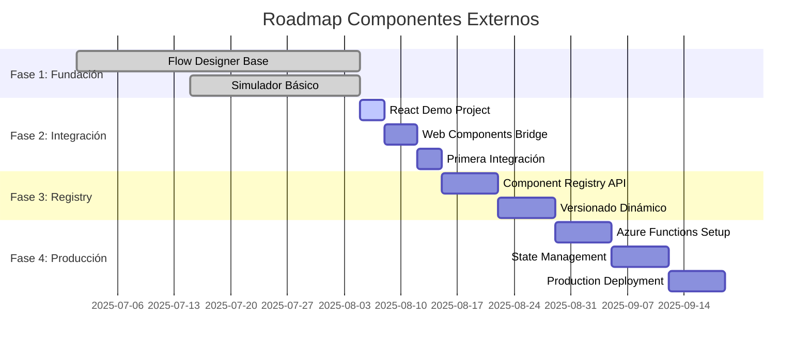

# 🛣️ Roadmap de Implementación: Componentes Externos

## 🎯 **Visión General del Roadmap**



---

## 📋 **Fase 2: Integración de Componentes (ACTUAL)**

### **Sprint 1: React Demo Project (3 días)**

#### **Objetivo**: Crear proyecto React que simule una fábrica externa

#### **Tasks**:

**Day 1: Setup del proyecto**
```bash
# Estructura objetivo
../react-components-demo/
├── package.json
├── webpack.config.js
├── src/
│   ├── components/
│   │   ├── INECapture/
│   │   │   ├── INECapture.tsx
│   │   │   ├── INECapture.test.tsx
│   │   │   └── index.ts
│   │   └── SMSVerification/
│   │       ├── SMSVerification.tsx
│   │       └── index.ts
│   ├── web-components/
│   │   ├── INECaptureElement.ts
│   │   └── SMSVerificationElement.ts
│   └── index.ts
├── dist/
│   ├── ine-capture.v1.0.0.js
│   └── sms-verification.v1.0.0.js
└── docs/
    └── integration-guide.md
```

**Deliverables**:
- [ ] Proyecto React configurado con TypeScript
- [ ] Webpack config para build de Web Components
- [ ] Setup de desarrollo con hot reload
- [ ] Scripts de build automatizado

**Day 2: Primer componente (INE Capture)**
```typescript
// INECapture.tsx - Componente React base
interface INECaptureProps {
  onDataCapture: (data: INEData) => void;
  onError: (error: string) => void;
  config?: INEConfig;
}

export const INECapture: React.FC<INECaptureProps> = ({
  onDataCapture,
  onError,
  config
}) => {
  // Simulación de captura de INE
  const [step, setStep] = useState<'front' | 'back' | 'review'>('front');
  const [capturedData, setCapturedData] = useState<Partial<INEData>>({});
  
  return (
    <div className="ine-capture">
      {step === 'front' && <CaptureFrontSide />}
      {step === 'back' && <CaptureBackSide />}
      {step === 'review' && <ReviewData />}
    </div>
  );
};
```

**Day 3: Web Component Wrapper**
```typescript
// INECaptureElement.ts - Web Component wrapper
class INECaptureElement extends HTMLElement {
  private reactRoot?: Root;
  
  connectedCallback() {
    this.attachShadow({ mode: 'open' });
    this.render();
  }
  
  disconnectedCallback() {
    this.reactRoot?.unmount();
  }
  
  // Métodos estándar para comunicación
  setInputData(data: any) {
    this.updateProps({ inputData: data });
  }
  
  private render() {
    const props = {
      onDataCapture: (data: INEData) => {
        this.dispatchEvent(new CustomEvent('output-data', {
          detail: { success: true, data },
          bubbles: true
        }));
      },
      onError: (error: string) => {
        this.dispatchEvent(new CustomEvent('node-error', {
          detail: { error },
          bubbles: true
        }));
      }
    };
    
    this.reactRoot = createRoot(this.shadowRoot!);
    this.reactRoot.render(React.createElement(INECapture, props));
  }
}

customElements.define('ine-capture-element', INECaptureElement);
```

---

### **Sprint 2: Vue Integration (4 días)**

#### **Objetivo**: Integrar primer componente React en simulador Vue

#### **Tasks**:

**Day 1-2: ExternalComponentLoader Enhancement**
```typescript
// src/services/ExternalComponentLoader.ts
export class ExternalComponentLoader {
  private static componentCache = new Map<string, any>();
  private static loadingPromises = new Map<string, Promise<any>>();
  
  static async loadReactComponent(config: ComponentConfig): Promise<ComponentWrapper> {
    const cacheKey = `${config.id}-${config.version}`;
    
    // Cache check
    if (this.componentCache.has(cacheKey)) {
      return this.componentCache.get(cacheKey);
    }
    
    // Prevent multiple loads of same component
    if (this.loadingPromises.has(cacheKey)) {
      return this.loadingPromises.get(cacheKey);
    }
    
    // Load component
    const loadPromise = this.loadComponentFromCDN(config);
    this.loadingPromises.set(cacheKey, loadPromise);
    
    try {
      const component = await loadPromise;
      this.componentCache.set(cacheKey, component);
      return component;
    } finally {
      this.loadingPromises.delete(cacheKey);
    }
  }
  
  private static async loadComponentFromCDN(config: ComponentConfig) {
    // Fallback URLs strategy
    const urls = [
      config.cdnUrl,
      config.fallbackUrl,
      `/local-components/${config.id}.js`
    ].filter(Boolean);
    
    for (const url of urls) {
      try {
        await this.loadScript(url);
        return this.createVueWrapper(config);
      } catch (error) {
        console.warn(`Failed to load from ${url}:`, error);
      }
    }
    
    throw new Error(`Failed to load component ${config.id} from all sources`);
  }
}
```

**Day 3: Simulator Integration**
```typescript
// En FlowCanvas.vue - modificar executeWizard
async function executeWizard() {
  // ... existing code ...
  
  for (const step of wizardSteps.value) {
    const node = nodes.value.find(n => n.id === step.nodeId);
    
    if (node?.data?.customTypeId) {
      // Es un componente externo
      try {
        const componentConfig = await getComponentConfig(node.data.customTypeId);
        const wrapper = await ExternalComponentLoader.loadReactComponent(componentConfig);
        
        // Crear step con componente externo
        step.externalComponent = wrapper;
        step.isExternal = true;
      } catch (error) {
        console.error('Failed to load external component:', error);
        // Fallback a componente placeholder
        step.placeholderMessage = `Error loading ${node.data.customTypeId}`;
      }
    }
  }
}
```

**Day 4: Testing & Polish**
- [ ] Unit tests para ExternalComponentLoader
- [ ] Integration tests Vue + React
- [ ] Error handling y fallbacks
- [ ] Performance profiling

---

### **Sprint 3: Multi-Component Support (3 días)**

#### **Objetivo**: Soportar múltiples componentes y configuración dinámica

#### **Tasks**:

**Day 1: Registry System (Mock)**
```typescript
// src/services/ComponentRegistry.ts
interface ComponentRegistry {
  id: string;
  name: string;
  provider: string;
  version: string;
  cdnUrl: string;
  fallbackUrl?: string;
  contract: {
    inputs: string[];
    outputs: string[];
    events: string[];
  };
  metadata: {
    description: string;
    category: string;
    icon?: string;
  };
}

export class ComponentRegistryService {
  private static registry: ComponentRegistry[] = [
    {
      id: 'ine-capture',
      name: 'INE Capture',
      provider: 'fabrica-identidad',
      version: '1.0.0',
      cdnUrl: 'http://localhost:3001/dist/ine-capture.v1.0.0.js',
      contract: {
        inputs: ['userId', 'sessionId'],
        outputs: ['ineData', 'images'],
        events: ['capture-complete', 'capture-error']
      },
      metadata: {
        description: 'Captura de credencial INE',
        category: 'Identidad'
      }
    },
    {
      id: 'sms-verification',
      name: 'SMS Verification',
      provider: 'fabrica-comunicaciones',
      version: '2.1.0',
      cdnUrl: 'http://localhost:3002/dist/sms-verification.v2.1.0.js',
      contract: {
        inputs: ['phoneNumber'],
        outputs: ['verificationResult'],
        events: ['code-sent', 'code-verified', 'verification-failed']
      },
      metadata: {
        description: 'Verificación por SMS',
        category: 'Comunicaciones'
      }
    }
  ];
  
  static async getComponentConfig(componentId: string): Promise<ComponentRegistry | null> {
    // En producción sería llamada a API
    return this.registry.find(c => c.id === componentId) || null;
  }
  
  static async getAllComponents(): Promise<ComponentRegistry[]> {
    return [...this.registry];
  }
}
```

**Day 2: Node Catalog Integration**
```typescript
// Actualizar nodeCatalog.ts para usar registry
const initializeExternalComponents = async () => {
  const externalComponents = await ComponentRegistryService.getAllComponents();
  
  const externalNodeTemplates: NodeTemplate[] = externalComponents.map(comp => ({
    id: comp.id,
    name: comp.name,
    subtitle: comp.metadata.description,
    categoria: comp.metadata.category,
    description: comp.metadata.description,
    version: comp.version,
    type: 'processNode',
    data: {
      icon: comp.metadata.icon || generateDefaultIcon(comp.name),
      customTypeId: comp.id,
      isExternal: true,
      provider: comp.provider
    }
  }));
  
  // Agregar al catálogo existente
  nodeTemplates.value.push(...externalNodeTemplates);
};
```

**Day 3: Multi-Provider Support**
- [ ] Configurar múltiples CDNs (simulando fábricas)
- [ ] Load balancing entre providers
- [ ] Health check de componentes
- [ ] Monitoring y alertas

---

## 📋 **Fase 3: Registry y Versionado (Siguientes 2 semanas)**

### **Sprint 4: Component Registry API**

#### **Backend Setup (Azure Functions)**
```typescript
// functions/ComponentRegistry/index.ts
import { AzureFunction, Context, HttpRequest } from "@azure/functions"

const httpTrigger: AzureFunction = async (context: Context, req: HttpRequest): Promise<void> => {
    const { method, params, query } = req;
    
    switch (method) {
        case 'GET':
            if (params.componentId) {
                // Get specific component
                context.res = {
                    body: await getComponent(params.componentId, query.version)
                };
            } else {
                // List all components
                context.res = {
                    body: await listComponents(query)
                };
            }
            break;
            
        case 'POST':
            // Register new component (for fábricas)
            context.res = {
                body: await registerComponent(req.body)
            };
            break;
    }
};

export default httpTrigger;
```

#### **Database Schema (Cosmos DB)**
```json
{
  "id": "ine-capture",
  "name": "INE Capture Component",
  "provider": {
    "id": "fabrica-identidad",
    "name": "Fábrica de Identidad Digital S.A.",
    "contact": "dev@fabrica-identidad.com"
  },
  "versions": [
    {
      "version": "1.0.0",
      "status": "active",
      "cdnUrl": "https://cdn.fabrica-identidad.com/ine-capture/1.0.0/component.js",
      "checksums": {
        "sha256": "abc123..."
      },
      "compatibility": {
        "minReactVersion": "17.0.0",
        "browsers": ["chrome>=90", "firefox>=88", "safari>=14"]
      },
      "publishedAt": "2025-08-01T10:00:00Z"
    },
    {
      "version": "1.1.0",
      "status": "beta",
      "cdnUrl": "https://cdn.fabrica-identidad.com/ine-capture/1.1.0/component.js",
      "publishedAt": "2025-08-15T10:00:00Z"
    }
  ],
  "contract": {
    "inputs": [
      {
        "name": "userId",
        "type": "string",
        "required": true,
        "description": "Identificador único del usuario"
      }
    ],
    "outputs": [
      {
        "name": "ineData",
        "type": "object",
        "description": "Datos extraídos de la INE"
      }
    ],
    "events": [
      {
        "name": "capture-complete",
        "payload": "{ success: boolean, data: INEData }"
      }
    ]
  },
  "metadata": {
    "category": "Identidad",
    "tags": ["ine", "identity", "capture"],
    "documentation": "https://docs.fabrica-identidad.com/ine-capture",
    "support": "support@fabrica-identidad.com"
  }
}
```

### **Sprint 5: Version Management**

#### **Semver Strategy**
```typescript
// Version selection logic
interface VersionConstraint {
  component: string;
  constraint: string; // "^1.0.0", "~2.1.0", ">=1.5.0 <2.0.0"
  environment: 'production' | 'staging' | 'development';
}

class VersionManager {
  static selectVersion(
    availableVersions: string[], 
    constraint: string
  ): string | null {
    // Usar semver para resolver constraint
    return semver.maxSatisfying(availableVersions, constraint);
  }
  
  static async loadComponentVersion(
    componentId: string, 
    versionConstraint: string
  ): Promise<ComponentConfig> {
    const registry = await ComponentRegistryService.getComponent(componentId);
    const selectedVersion = this.selectVersion(
      registry.versions.map(v => v.version),
      versionConstraint
    );
    
    if (!selectedVersion) {
      throw new Error(`No version satisfies constraint ${versionConstraint}`);
    }
    
    return registry.versions.find(v => v.version === selectedVersion)!;
  }
}
```

#### **A/B Testing Support**
```typescript
// Feature flags para componentes
interface ComponentFeatureFlag {
  componentId: string;
  variants: {
    version: string;
    traffic: number; // Percentage 0-100
    userGroups?: string[];
  }[];
}

const featureFlags: ComponentFeatureFlag[] = [
  {
    componentId: 'ine-capture',
    variants: [
      { version: '1.0.0', traffic: 80 },
      { version: '1.1.0-beta', traffic: 20, userGroups: ['beta-testers'] }
    ]
  }
];
```

---

## 📋 **Fase 4: Producción y Escalabilidad**

### **Sprint 6: State Management Distribuido**

#### **Redux Toolkit Query para Cache**
```typescript
// src/store/componentApi.ts
import { createApi, fetchBaseQuery } from '@reduxjs/toolkit/query/react'

export const componentApi = createApi({
  reducerPath: 'componentApi',
  baseQuery: fetchBaseQuery({
    baseUrl: 'https://component-registry.azurewebsites.net/api/',
  }),
  tagTypes: ['Component'],
  endpoints: (builder) => ({
    getComponent: builder.query<ComponentRegistry, {id: string, version?: string}>({
      query: ({id, version}) => `components/${id}${version ? `?version=${version}` : ''}`,
      providesTags: ['Component'],
    }),
    listComponents: builder.query<ComponentRegistry[], void>({
      query: () => 'components',
      providesTags: ['Component'],
    }),
  }),
})
```

#### **Event Sourcing para Node State**
```typescript
// src/store/nodeEventStore.ts
interface NodeEvent {
  id: string;
  nodeId: string;
  type: 'data-changed' | 'validation-failed' | 'completed';
  payload: any;
  timestamp: Date;
  userId: string;
}

class NodeEventStore {
  private events: NodeEvent[] = [];
  
  addEvent(event: Omit<NodeEvent, 'id' | 'timestamp'>) {
    const newEvent: NodeEvent = {
      ...event,
      id: generateId(),
      timestamp: new Date()
    };
    
    this.events.push(newEvent);
    this.notifySubscribers(newEvent);
  }
  
  getNodeState(nodeId: string): any {
    // Replay events to get current state
    return this.events
      .filter(e => e.nodeId === nodeId)
      .reduce((state, event) => this.applyEvent(state, event), {});
  }
}
```

### **Sprint 7: Performance & Monitoring**

#### **Metrics Collection**
```typescript
// src/services/MetricsService.ts
interface ComponentMetrics {
  componentId: string;
  version: string;
  loadTime: number;
  renderTime: number;
  errorCount: number;
  userInteractions: number;
  memoryUsage: number;
}

class MetricsService {
  static trackComponentLoad(componentId: string, version: string, loadTime: number) {
    // Enviar a Application Insights
    appInsights.trackMetric('component.load.time', loadTime, {
      componentId,
      version
    });
  }
  
  static trackComponentError(componentId: string, error: Error) {
    appInsights.trackException({
      exception: error,
      properties: { componentId }
    });
  }
}
```

#### **Performance Budget**
```typescript
// webpack.config.js - Bundle size limits
module.exports = {
  performance: {
    maxAssetSize: 250000,    // 250kb per component
    maxEntrypointSize: 250000,
    hints: 'error'
  },
  
  // Code splitting por componente
  optimization: {
    splitChunks: {
      chunks: 'all',
      cacheGroups: {
        vendor: {
          test: /[\\/]node_modules[\\/]/,
          name: 'vendors',
          chunks: 'all',
        },
        component: {
          test: /[\\/]components[\\/]/,
          name: 'component',
          chunks: 'all',
        }
      }
    }
  }
};
```

---

## 🎯 **Definition of Done por Sprint**

### **Sprint 1 (React Demo) - Done Criteria:**
- [ ] Proyecto React funcional con hot reload
- [ ] Al menos 2 componentes (INE, SMS) implementados
- [ ] Web Components wrapper funcionando
- [ ] Build process automatizado
- [ ] Documentación de setup para fábricas

### **Sprint 2 (Vue Integration) - Done Criteria:**
- [ ] ExternalComponentLoader carga componentes React
- [ ] Simulador ejecuta componentes externos
- [ ] Error handling y fallbacks implementados
- [ ] Performance acceptable (< 2s load time)
- [ ] Tests unitarios y de integración passing

### **Sprint 3 (Multi-Component) - Done Criteria:**
- [ ] Registry mock funcional
- [ ] Node catalog integra componentes dinámicamente
- [ ] Múltiples proveedores soportados
- [ ] Load balancing básico implementado
- [ ] Health checks funcionando

### **Sprint 4 (Registry API) - Done Criteria:**
- [ ] Azure Functions desplegadas
- [ ] Cosmos DB configurada
- [ ] API REST completa (CRUD componentes)
- [ ] Versionado semántico soportado
- [ ] Documentation API generada

### **Sprint 5 (Version Management) - Done Criteria:**
- [ ] Constraint resolution funcionando
- [ ] A/B testing básico implementado
- [ ] Rollback automático en errores
- [ ] Feature flags operacionales
- [ ] Monitoring de versiones activo

### **Sprint 6 (State Management) - Done Criteria:**
- [ ] Redux Toolkit Query integrado
- [ ] Event sourcing para node state
- [ ] Cache distribuido funcionando
- [ ] Performance mejorado 50%
- [ ] Estado persistente entre sesiones

### **Sprint 7 (Production) - Done Criteria:**
- [ ] Métricas completas implementadas
- [ ] Performance budget respetado
- [ ] CDN configurado globalmente
- [ ] Monitoring y alertas activos
- [ ] Load testing passed (200 trámites/min)

---

## 🚨 **Risk Mitigation**

### **Riesgo 1: Fábricas no entregan a tiempo**
**Mitigación**: 
- Mock components para desarrollo
- Contratos estrictos con penalties
- Multiple providers por capability

### **Riesgo 2: Performance degradation**
**Mitigación**:
- Performance budgets estrictos
- Lazy loading obligatorio
- Circuit breakers para componentes lentos

### **Riesgo 3: Security vulnerabilities**
**Mitigación**:
- Code scanning automático
- Sandbox execution con Shadow DOM
- CSP headers estrictos

### **Riesgo 4: Vendor lock-in**
**Mitigación**:
- Estándares web (Web Components)
- Multiple CDN providers
- Exit strategy documentada

---

**Status**: 📊 **Fase 2 - Sprint 1 en progreso**  
**Próxima revisión**: Al completar cada sprint  
**Escalación**: Para blockers > 2 días

---

*"Plan the work, work the plan, adapt as needed."*
