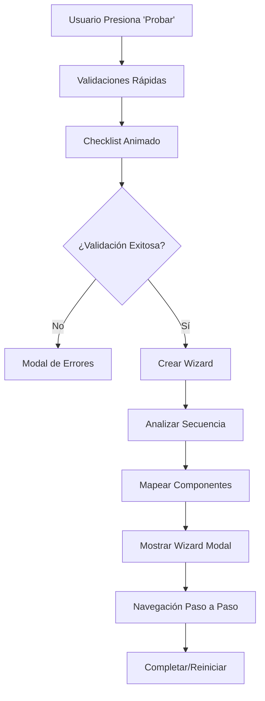

# Sistema de Wizard Simulador y Validación de Flujos

## Índice
1. [Resumen Ejecutivo](#resumen-ejecutivo)
2. [Arquitectura del Sistema](#arquitectura-del-sistema)
3. [Sistema de Validación](#sistema-de-validación)
4. [Wizard Simulador](#wizard-simulador)
5. [Problemáticas y Soluciones](#problemáticas-y-soluciones)
6. [Interfaces TypeScript](#interfaces-typescript)
7. [Flujo de Ejecución](#flujo-de-ejecución)
8. [Guía de Implementación](#guía-de-implementación)

## Resumen Ejecutivo

El **Sistema de Wizard Simulador** es una funcionalidad avanzada del Flow Designer que permite ejecutar flujos definidos como procesos paso a paso con interfaces de usuario reales. El sistema transforma automáticamente un flujo de nodos en un wizard interactivo que simula la experiencia completa del usuario final.

### Características Principales
- **Análisis automático de flujos** siguiendo conexiones entre nodos
- **Mapeo dinámico** de nodos a componentes de vista específicos
- **Navegación paso a paso** con progreso visual
- **Validación integral** antes de la ejecución
- **Omisión inteligente** de nodos de motor (engineNode)

## Arquitectura del Sistema

### Componentes Principales

```
┌─────────────────────────────────────────┐
│           FlowCanvas.vue                │
├─────────────────────────────────────────┤
│  ┌─────────────────────────────────────┐│
│  │     Sistema de Validación          ││
│  │  - runNodeValidations()            ││
│  │  - Reglas de negocio               ││
│  │  - Validación de estructura        ││
│  └─────────────────────────────────────┘│
│  ┌─────────────────────────────────────┐│
│  │     Test System                    ││
│  │  - Checklist animado               ││
│  │  - Resultados de validación        ││
│  │  - Cancelación de procesos          ││
│  └─────────────────────────────────────┘│
│  ┌─────────────────────────────────────┐│
│  │     Wizard Simulator               ││
│  │  - createWizardFromFlow()          ││
│  │  - Análisis de secuencia           ││
│  │  - Mapeo de componentes            ││
│  │  - Navegación y control            ││
│  └─────────────────────────────────────┘│
└─────────────────────────────────────────┘
```

### Flujo de Estados



## Sistema de Validación

### Validaciones Implementadas

#### 1. Validaciones Estructurales
- **Nodo START obligatorio**: Exactamente un nodo de tipo `start`
- **Nodo END obligatorio**: Al menos un nodo de tipo `end`
- **Conexiones válidas**: Todos los nodos deben estar conectados
- **Nodos huérfanos**: Detección de nodos sin conexiones

#### 2. Validaciones de Negocio
- **Flujo continuo**: Verificación de camino completo desde START hasta END
- **Tipos de nodo válidos**: Validación de tipos permitidos
- **Configuración de nodos**: Verificación de propiedades requeridas

### Función Principal de Validación

```typescript
function runNodeValidations(showNotifications: boolean = true): boolean {
    const errors: string[] = [];
    
    // Validar nodo START
    const startNodes = nodes.value.filter(n => n.type === 'start');
    if (startNodes.length === 0) {
        errors.push('Debe existir exactamente un nodo START');
    }
    
    // Validar nodo END
    const endNodes = nodes.value.filter(n => n.type === 'end');
    if (endNodes.length === 0) {
        errors.push('Debe existir al menos un nodo END');
    }
    
    // Validar conexiones
    const connectedNodes = new Set<string>();
    edges.value.forEach(edge => {
        connectedNodes.add(edge.source);
        connectedNodes.add(edge.target);
    });
    
    // Mostrar resultados
    if (errors.length > 0 && showNotifications) {
        showDanger('Errores de validación detectados', {
            title: 'Flujo inválido',
            description: errors.join('\n'),
            duration: 8000
        });
        return false;
    }
    
    return true;
}
```

## Wizard Simulador

### Funcionalidad Principal

El wizard simulador transforma un flujo de nodos en una experiencia paso a paso que simula la ejecución real del proceso definido.

#### 1. Análisis de Secuencia

```typescript
function buildFlowSequence(): Node[] {
    const sequence: Node[] = [];
    const visitedNodes = new Set<string>();
    
    // Encontrar nodo START
    const startNode = nodes.value.find(node => node.type === 'start');
    if (!startNode) return [];
    
    let currentNode: Node | null = startNode;
    
    while (currentNode) {
        // Solo incluir nodos de vista (omitir engineNodes)
        if (currentNode.type === 'start' || 
            currentNode.type === 'processNode' || 
            currentNode.type === 'end') {
            sequence.push(currentNode);
        }
        
        visitedNodes.add(currentNode.id);
        currentNode = findNextNode(currentNode.id, visitedNodes);
        
        // Prevenir bucles infinitos
        if (sequence.length > 20) break;
    }
    
    return sequence;
}
```

#### 2. Mapeo de Componentes

```typescript
// Mapeo específico por label para processNodes
const processNodeMapping: Record<string, { 
    title: string; 
    component: string; 
    description: string 
}> = {
    'INE': {
        title: 'INE',
        component: 'INECaptureView',
        description: 'Captura de fotografía de identificación oficial'
    },
    'Captura Rápida': {
        title: 'Captura Rápida',
        component: 'QuickCaptureView',
        description: 'Captura rápida de datos básicos'
    },
    'Firma': {
        title: 'Firma',
        component: 'SignatureView',
        description: 'Captura de firma digital con cursor'
    },
    // ... más mapeos
};
```

#### 3. Navegación del Wizard

```typescript
function nextWizardStep() {
    if (currentWizardStep.value < wizardSteps.value.length - 1) {
        wizardSteps.value[currentWizardStep.value].completed = true;
        currentWizardStep.value++;
    } else {
        wizardSteps.value[currentWizardStep.value].completed = true;
        wizardCompleted.value = true;
    }
}

function previousWizardStep() {
    if (currentWizardStep.value > 0) {
        currentWizardStep.value--;
    }
}
```

### Interfaz del Usuario

#### Modal del Wizard
- **Barra de progreso** con indicador visual del avance
- **Título del paso actual** tomado directamente del label del nodo
- **Descripción contextual** del proceso actual
- **Placeholder de componente** o componente real si existe
- **Controles de navegación** (Anterior/Siguiente/Completar)

#### Características de UX
- **Progreso visual** con porcentaje completado
- **Navegación bidireccional** con validación
- **Estados de completado** persistentes por paso
- **Capacidad de reinicio** del proceso

## Problemáticas y Soluciones

### 1. Problema: Orden Incorrecto de Pasos

**Problemática:**
- El wizard inicialmente mostraba los nodos en el orden del array, no en el orden del flujo real
- Los pasos no reflejaban la secuencia de conexiones definida en el canvas

**Solución Implementada:**
```typescript
// Algoritmo de seguimiento de conexiones
function findNextNode(currentNodeId: string, visitedNodes: Set<string>): Node | null {
    const outgoingEdges = edges.value.filter(edge => edge.source === currentNodeId);
    
    for (const edge of outgoingEdges) {
        const nextNode = nodes.value.find(node => node.id === edge.target);
        if (nextNode && !visitedNodes.has(nextNode.id)) {
            return nextNode;
        }
    }
    
    return null;
}
```

**Resultado:** El wizard ahora respeta exactamente el orden de conexiones definido en el flujo.

### 2. Problema: Inclusión de Nodos de Motor

**Problemática:**
- Los `engineNode` aparecían en el wizard como pasos del usuario
- Estos nodos representan procesos internos/API que no requieren interacción

**Solución Implementada:**
```typescript
// Filtrado inteligente en buildFlowSequence()
if (currentNode.type === 'start' || 
    currentNode.type === 'processNode' || 
    currentNode.type === 'end') {
    sequence.push(currentNode);
}
// engineNode son omitidos automáticamente
```

**Resultado:** Solo se incluyen nodos que requieren interacción del usuario.

### 3. Problema: Mapeo de Títulos Inconsistente

**Problemática:**
- Los títulos del wizard no coincidían con los labels de los nodos
- Se mostraban títulos mapeados en lugar de los nombres originales

**Solución Implementada:**
```typescript
// Uso directo del label del nodo como título
stepInfo = {
    title: nodeLabel, // Label original del nodo
    component: mapping.component,
    description: mapping.description
};
```

**Resultado:** Los títulos del wizard son exactamente los mismos que aparecen en los nodos del canvas.

### 4. Problema: Errores de TypeScript

**Problemática:**
- Errores de tipado con `keyof typeof` en mapeos
- Parámetros no utilizados generando warnings

**Solución Implementada:**
```typescript
// Casting correcto para acceso a propiedades
stepInfo = nodeViewMapping[node.type as keyof typeof nodeViewMapping];

// Prefijo underscore para parámetros no utilizados
function componentExists(_componentName: string): boolean {
    return false;
}
```

**Resultado:** Código libre de errores de TypeScript con tipado estricto.

### 5. Problema: Cancelación de Tests

**Problemática:**
- Los tests no se podían cancelar una vez iniciados
- Timeouts seguían ejecutándose después de cancelar

**Solución Implementada:**
```typescript
// Sistema de gestión de timeouts
let testTimeouts: number[] = [];

function cancelTestFlow() {
    testCancelled.value = true;
    
    // Limpiar todos los timeouts pendientes
    testTimeouts.forEach(timeoutId => {
        clearTimeout(timeoutId);
    });
    testTimeouts = [];
}
```

**Resultado:** Cancelación limpia y completa de procesos de test.

## Interfaces TypeScript

### WizardStep
```typescript
interface WizardStep {
    id: string;           // Identificador único del paso
    nodeId: string;       // ID del nodo original en el flujo
    title: string;        // Título (label del nodo)
    type: 'view' | 'process'; // Tipo de paso
    component: string;    // Nombre del componente Vue
    description: string;  // Descripción del proceso
    completed: boolean;   // Estado de completado
}
```

### ChecklistItem
```typescript
interface ChecklistItem {
    id: number;          // ID único del item
    text: string;        // Texto descriptivo
    completed: boolean;  // Estado de completado
}
```

### TestResults
```typescript
interface TestResults {
    status: 'success' | 'error';
    message: string;
    details?: string;
    timestamp: string;
}
```

## Flujo de Ejecución

### 1. Iniciación del Test
```
Usuario → Botón "Probar" → testFlow() → Validaciones rápidas → Checklist animado
```

### 2. Proceso de Validación
```
runTestChecklist() → Animación secuencial → runNodeValidations() → Resultados
```

### 3. Creación del Wizard
```
createWizardFromFlow() → buildFlowSequence() → Mapeo de componentes → UI del wizard
```

### 4. Navegación del Usuario
```
Wizard Modal → nextWizardStep() → Actualización de progreso → Finalización
```

## Guía de Implementación

### Para Desarrolladores

#### 1. Agregar Nuevos Tipos de Nodo
```typescript
// En processNodeMapping
'NuevoTipoNodo': {
    title: 'Nuevo Proceso',
    component: 'NuevoComponenteView',
    description: 'Descripción del nuevo proceso'
}
```

#### 2. Crear Componentes de Vista
```vue
<!-- NuevoComponenteView.vue -->
<template>
    <div class="nuevo-componente">
        <h3>Nuevo Proceso</h3>
        <p>Implementación específica del proceso</p>
        <!-- Controles específicos -->
    </div>
</template>
```

#### 3. Extender Validaciones
```typescript
// Agregar en runNodeValidations()
if (specificCondition) {
    errors.push('Nueva regla de validación');
}
```

### Funciones de Debug Disponibles

En la consola del navegador:
- `window.debugNodes()` - Ver todos los nodos del flujo
- `window.debugWizard()` - Crear y analizar wizard de prueba
- `window.testNodeDeletion()` - Probar eliminación de nodos

### Configuración Adicional

#### Estados Reactivos Principales
```typescript
const showWizardModal = ref(false);
const wizardSteps = ref<WizardStep[]>([]);
const currentWizardStep = ref(0);
const wizardCompleted = ref(false);
```

#### Funciones de Control
- `nextWizardStep()` - Avanzar paso
- `previousWizardStep()` - Retroceder paso
- `closeWizard()` - Cerrar y resetear
- `restartWizard()` - Reiniciar desde el inicio

## Conclusiones

El sistema de Wizard Simulador representa una funcionalidad avanzada que:

1. **Mejora la experiencia del usuario** al permitir previsualizar flujos
2. **Facilita el testing** con validaciones automáticas
3. **Proporciona retroalimentación inmediata** sobre la estructura del flujo
4. **Simula la experiencia real** del usuario final

El sistema es **extensible**, **mantenible** y **robusto**, con manejo completo de errores y una arquitectura bien definida que permite futuras expansiones.

---

*Documentación generada para Flow Designer v1.0.0*
*Última actualización: Enero 2025*
